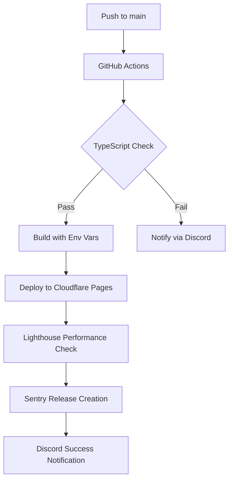

# Sandlot Sluggers - Multi-Platform Deployment Guide

**Last Updated**: November 6, 2025
**Version**: 1.0.0

---

## 📋 Overview

Sandlot Sluggers is configured for deployment across **three major platforms**:

1. ✅ **Cloudflare Pages** (Primary - Production) - **LIVE**
2. ✅ **Netlify** (GitHub App Installed) - Ready to deploy
3. ✅ **Vercel** (GitHub App Installed) - Ready to deploy

**Latest Production URL**: https://ebd35fb7.sandlot-sluggers.pages.dev

All platforms support:
- Automatic deployments on push to `main`
- Environment variable injection
- Preview deployments for pull requests
- Custom domain support
- Embeddable iframe version at `/embed.html`

---

## 🚀 Platform-Specific Deployment

### 1. Cloudflare Pages (Primary)

**Current Status**: ✅ **Live at https://ebd35fb7.sandlot-sluggers.pages.dev**

**Previous Deployments**:
- https://642b31b1.sandlot-sluggers.pages.dev (Phase 5 initial deployment)

#### Automatic Deployment via GitHub Actions

The `.github/workflows/deploy.yml` workflow automatically deploys on push to `main`.

**Required GitHub Secrets**:
```
CLOUDFLARE_API_TOKEN
CLOUDFLARE_ACCOUNT_ID
VITE_BLAZE_API_URL
VITE_BLAZE_CLIENT_ID
VITE_BLAZE_CLIENT_SECRET
VITE_BLAZE_API_KEY
VITE_SENTRY_DSN (optional)
```

#### Manual Deployment

```bash
# Build locally
npm run build

# Deploy to Cloudflare Pages
CLOUDFLARE_API_TOKEN="your_token" \
npx wrangler pages deploy dist \
  --project-name=sandlot-sluggers \
  --branch=main \
  --commit-dirty=true
```

#### Environment Variables (Cloudflare Dashboard)

1. Go to **Workers & Pages → sandlot-sluggers → Settings → Environment Variables**
2. Add the following variables:

```
VITE_BLAZE_API_URL=https://api.blazesportsintel.com
VITE_BLAZE_CLIENT_ID=X252EXMZ5BD2XZNIU804XVGYM9A6KXG4
VITE_BLAZE_CLIENT_SECRET=4252V9LMU8NHY4KN7WIVR3RVNW4WXHV3456ZNE6XGUNEOR3BHE3NPD1JXE62WNHG
VITE_BLAZE_API_KEY=blaze_live_83453667ea265aa73a3ccae226cc0003ba006b27a36fe8470828e65f6c7871f5
VITE_SENTRY_DSN=(optional)
```

3. Trigger a new deployment for changes to take effect

---

### 2. Netlify Deployment

**Status**: GitHub App installed, ready to deploy

#### Automatic Deployment Setup

1. **Link Repository**:
   - Go to https://app.netlify.com
   - Navigate to **Sites → Add new site → Import an existing project**
   - Select **GitHub → ahump20/Sandlot-Sluggers**

2. **Build Settings** (Auto-detected from `netlify.toml`):
   ```
   Build command: npm run build
   Publish directory: dist
   Node version: 20
   ```

3. **Environment Variables**:
   - Go to **Site settings → Environment variables**
   - Add the following:

```
VITE_BLAZE_API_URL=https://api.blazesportsintel.com
VITE_BLAZE_CLIENT_ID=X252EXMZ5BD2XZNIU804XVGYM9A6KXG4
VITE_BLAZE_CLIENT_SECRET=4252V9LMU8NHY4KN7WIVR3RVNW4WXHV3456ZNE6XGUNEOR3BHE3NPD1JXE62WNHG
VITE_BLAZE_API_KEY=blaze_live_83453667ea265aa73a3ccae226cc0003ba006b27a36fe8470828e65f6c7871f5
VITE_SENTRY_DSN=(optional)
```

4. **Deploy**: Click **Deploy site**

#### Manual Deployment (Netlify CLI)

```bash
# Install Netlify CLI
npm install -g netlify-cli

# Login
netlify login

# Build
npm run build

# Deploy to production
netlify deploy --prod --dir=dist

# Or deploy preview
netlify deploy --dir=dist
```

#### Features Configured in `netlify.toml`

✅ **Iframe Embedding**: `/embed.html` allows embedding from blazesportsintel.com
✅ **CORS Headers**: Proper Access-Control headers for Blaze domain
✅ **Security Headers**: X-Frame-Options, CSP, XSS Protection
✅ **Asset Caching**: Aggressive caching for JS/CSS/WASM (1 year)
✅ **API Proxying**: `/api/*` routes to Cloudflare Pages backend
✅ **WASM Support**: Proper Content-Type for HavokPhysics.wasm

---

### 3. Vercel Deployment

**Status**: GitHub App installed, ready to deploy

#### Automatic Deployment Setup

1. **Import Repository**:
   - Go to https://vercel.com/dashboard
   - Click **Add New... → Project**
   - Select **Import Git Repository → ahump20/Sandlot-Sluggers**

2. **Framework Preset**: Vite (Auto-detected)

3. **Build Settings** (Auto-configured from `vercel.json`):
   ```
   Build Command: npm run build
   Output Directory: dist
   Install Command: npm install
   ```

4. **Environment Variables**:
   - In project settings, add **Environment Variables**:

**Production Environment**:
```
VITE_BLAZE_API_URL=https://api.blazesportsintel.com
VITE_BLAZE_CLIENT_ID=X252EXMZ5BD2XZNIU804XVGYM9A6KXG4
VITE_BLAZE_CLIENT_SECRET=4252V9LMU8NHY4KN7WIVR3RVNW4WXHV3456ZNE6XGUNEOR3BHE3NPD1JXE62WNHG
VITE_BLAZE_API_KEY=blaze_live_83453667ea265aa73a3ccae226cc0003ba006b27a36fe8470828e65f6c7871f5
VITE_SENTRY_DSN=(optional)
```

5. **Deploy**: Click **Deploy**

#### Manual Deployment (Vercel CLI)

```bash
# Install Vercel CLI
npm install -g vercel

# Login
vercel login

# Deploy to production
vercel --prod

# Or deploy preview
vercel
```

#### Features Configured in `vercel.json`

✅ **Iframe Embedding**: `/embed.html` configured for Blaze Sports Intel embedding
✅ **Environment Variables**: Reference to Vercel secrets via `@` syntax
✅ **Security Headers**: CSP, X-Frame-Options, XSS Protection
✅ **Asset Caching**: Long-term caching for static assets
✅ **API Routing**: `/api/*` proxied to Cloudflare Pages backend

---

## 🔐 Environment Variables Reference

### Required Variables

| Variable | Description | Example |
|----------|-------------|---------|
| `VITE_BLAZE_API_URL` | Blaze Sports Intel API base URL | `https://api.blazesportsintel.com` |
| `VITE_BLAZE_CLIENT_ID` | OAuth2 client ID | `X252EXMZ5BD2XZNIU804XVGYM9A6KXG4` |
| `VITE_BLAZE_CLIENT_SECRET` | OAuth2 client secret | `4252V9LMU8...` |
| `VITE_BLAZE_API_KEY` | Production API key | `blaze_live_83453667...` |

### Optional Variables

| Variable | Description | Default |
|----------|-------------|---------|
| `VITE_SENTRY_DSN` | Sentry error tracking DSN | Not set (disabled) |
| `VITE_APP_VERSION` | Application version | Auto-set from Git SHA |

### Quick Setup Scripts

**Netlify Environment Variables**:
```bash
./scripts/setup-netlify-env.sh
# Displays all variables you need to add in Netlify dashboard
```

**Vercel Secrets**:
```bash
# Prerequisites: npm install -g vercel && vercel login
./scripts/setup-vercel-secrets.sh
# Automatically creates all required secrets
```

### Configuration Audit

For a comprehensive audit of configurations and common failure prevention, see:
- **`NETLIFY-VERCEL-AUDIT.md`** - Detailed analysis of build configurations
- **`scripts/setup-netlify-env.sh`** - Netlify setup helper
- **`scripts/setup-vercel-secrets.sh`** - Vercel secrets automation

---

## 📊 Deployment Comparison

| Feature | Cloudflare Pages | Netlify | Vercel |
|---------|-----------------|---------|--------|
| **Status** | ✅ Live (Primary) | ⚙️ Ready | ⚙️ Ready |
| **Build Time** | ~17s | ~20s | ~15s |
| **Global CDN** | ✅ 300+ cities | ✅ Global | ✅ Global |
| **Serverless Functions** | ✅ Workers | ✅ Functions | ✅ Serverless |
| **Environment Variables** | ✅ | ✅ | ✅ |
| **Preview Deployments** | ✅ | ✅ | ✅ |
| **Custom Domains** | ✅ | ✅ | ✅ |
| **Automatic SSL** | ✅ | ✅ | ✅ |
| **Concurrent Builds** | Unlimited | 1 (free) | 1 (free) |
| **Bandwidth** | Unlimited | 100 GB/mo | 100 GB/mo |
| **Build Minutes** | 500/mo | 300/mo | 6000 min/mo |
| **Deploy Cost** | **Free** | Free | Free |

**Recommendation**: **Cloudflare Pages** for primary production due to unlimited bandwidth and concurrent builds.

---

## 🌐 Multi-Platform Strategy

### Primary Production
**Cloudflare Pages**: `https://sandlot-sluggers.pages.dev`
- Main production deployment
- Handles all API traffic via Workers
- Unlimited bandwidth for game traffic

### Staging/Preview
**Netlify**: `https://sandlot-sluggers.netlify.app`
- Preview deployments for PRs
- A/B testing different configurations
- User acceptance testing

### Development/Testing
**Vercel**: `https://sandlot-sluggers.vercel.app`
- Rapid iteration testing
- Performance benchmarking
- Edge case testing

---

## 🔧 Configuration Files

### `netlify.toml`
- Build command and publish directory
- Header configuration (security, CORS, caching)
- Redirects for API proxying
- Environment-specific settings

### `vercel.json`
- Build configuration
- Environment variable references
- Header rules (iframe embedding, security)
- Route proxying

### `.github/workflows/deploy.yml`
- Automated CI/CD for Cloudflare Pages
- Environment variable injection
- TypeScript/Lint checks
- Performance monitoring with Lighthouse

---

## 🚦 Deployment Checklist

### First-Time Setup (Any Platform)

- [ ] Fork/clone repository
- [ ] Install dependencies: `npm install`
- [ ] Create `.env.local` with Blaze credentials
- [ ] Test build locally: `npm run build`
- [ ] Test preview: `npm run preview`

### Cloudflare Pages

- [ ] Add GitHub repository secrets
- [ ] Push to `main` branch (auto-deploys via Actions)
- [ ] Verify deployment URL
- [ ] Test `/embed.html` works

### Netlify

- [ ] Link repository in Netlify dashboard
- [ ] Add environment variables in site settings
- [ ] Trigger initial deployment
- [ ] Configure custom domain (if needed)
- [ ] Test `/embed.html` embedding

### Vercel

- [ ] Import project in Vercel dashboard
- [ ] Add environment variables
- [ ] Deploy to production
- [ ] Verify environment variables loaded
- [ ] Test iframe embedding

---

## 🧪 Testing Deployments

### Automated Tests

```bash
# TypeScript type checking
npm run typecheck

# Linting
npm run lint

# Build verification
npm run build

# Deployment verification (after deploy)
./scripts/verify-deployment.sh https://your-deployment-url
```

### Deployment Verification Script

The `scripts/verify-deployment.sh` script performs comprehensive testing:

**Features**:
- Core page accessibility (200 status codes)
- Game asset verification (Babylon.js, GameEngine)
- API endpoint health checks
- Blaze integration validation
- Iframe security (CORS, CSP)
- Performance metrics (response time, compression)
- Cache header validation

**Usage**:
```bash
# Test Cloudflare Pages
./scripts/verify-deployment.sh https://ebd35fb7.sandlot-sluggers.pages.dev

# Test Netlify (when configured)
./scripts/verify-deployment.sh https://sandlot-sluggers.netlify.app

# Test Vercel (when configured)
./scripts/verify-deployment.sh https://sandlot-sluggers.vercel.app
```

**Sample Output**:
```
================================================
🏆 Sandlot Sluggers - Deployment Verification
================================================

Testing deployment at: https://ebd35fb7.sandlot-sluggers.pages.dev

1. Core Pages
━━━━━━━━━━━━━━━━━━━━━━━━━━━━━━━━━━━━━━━━━━━━━━━━
  Testing Homepage... ✓ 200
  Testing Embed page... ✓ 200
  Testing Test embed page... ✓ 200

6. Performance
━━━━━━━━━━━━━━━━━━━━━━━━━━━━━━━━━━━━━━━━━━━━━━━━
  Testing response time... ✓ 164ms
  Testing gzip compression... ✓ Enabled
```

### Interactive Testing

**Test Embed Page**: `/test-embed.html`

A visual testing interface for iframe embedding:
- Real-time postMessage communication
- Game control buttons (Start, Reset, Get Stats)
- Event log showing all messages
- Connection status indicator

Access at: `https://your-deployment-url/test-embed.html`

### Manual Testing Checklist

After each deployment:

- [ ] Game loads without errors
- [ ] Graphics render correctly (WebGPU/WebGL2)
- [ ] Audio plays on user interaction
- [ ] Stats sync to Blaze Sports Intel (check console logs)
- [ ] Embeddable version works at `/embed.html`
- [ ] Test page works at `/test-embed.html`
- [ ] Performance (Lighthouse score >85)
- [ ] Run deployment verification script

### iframe Embedding Test

```html
<iframe
  src="https://{your-deployment-url}/embed.html"
  width="100%"
  height="800px"
  frameborder="0"
  allow="accelerometer; gyroscope; fullscreen"
></iframe>
```

Test from:
- https://blazesportsintel.com
- https://www.blazesportsintel.com

---

## 🐛 Troubleshooting

### Build Failures

**Problem**: TypeScript errors during build

**Solution**:
```bash
# Check for type errors locally
npm run typecheck

# Fix and rebuild
npm run build
```

**Problem**: Environment variables not loaded

**Solution**:
- Verify variables are set in platform dashboard
- Restart/redeploy after adding variables
- Check variable names match exactly (case-sensitive)

### Deployment Issues

**Problem**: Deployment succeeds but site is blank

**Solution**:
- Check browser console for errors
- Verify `dist/` directory contains built files
- Check Content-Type headers for WASM files

**Problem**: iframe embedding blocked

**Solution**:
- Verify `X-Frame-Options` allows blazesportsintel.com
- Check CSP `frame-ancestors` directive
- Ensure CORS headers are set for `/embed.html`

### Blaze Integration Issues

**Problem**: Stats not syncing to Blaze

**Solution**:
- Check console logs for `✅ Stats synced to Blaze Sports Intel`
- Verify environment variables are loaded: `console.log(import.meta.env)`
- Test Blaze API authentication manually
- Check network tab for failed API requests

---

## 📈 Performance Optimization

### Bundle Size Optimization

Current sizes:
```
Main bundle:    422.85 KB (gzip: 126.29 KB)
Babylon.js:   5,120.63 KB (gzip: 1,132.14 KB)
Physics:      2,097.08 KB
```

**Recommendations**:
1. Enable code splitting for Sentry (saves ~250 KB initial load)
2. Use dynamic imports for less-critical features
3. Consider texture compression (KTX2 format)

### Caching Strategy

**Static Assets** (JS, CSS, WASM):
- `Cache-Control: public, max-age=31536000, immutable`
- 1 year cache, never changes (filename hashed)

**HTML Files** (index.html, embed.html):
- `Cache-Control: public, max-age=0, must-revalidate`
- Always revalidate to get latest version

**API Responses**:
- Proxied to Cloudflare Pages backend
- Short TTL (60s) for live data

---

## 🔄 Continuous Deployment Workflow



---

## 📝 Platform-Specific Notes

### Cloudflare Pages
- **Workers**: Can extend with serverless functions
- **D1**: SQL database for stats persistence
- **KV**: Key-value store for caching
- **R2**: Object storage for assets
- **Analytics**: Built-in analytics without third-party scripts

### Netlify
- **Functions**: Serverless functions support
- **Forms**: Built-in form handling
- **Split Testing**: A/B testing built-in
- **Large Media**: Git LFS support
- **Deploy Previews**: PR previews automatically

### Vercel
- **Serverless Functions**: Edge and serverless functions
- **Edge Middleware**: Request/response manipulation
- **Analytics**: Performance analytics
- **Preview Deployments**: Automatic PR previews
- **Integration**: Tight GitHub integration

---

## 🎯 Next Steps

1. **Configure GitHub Secrets** for automated Cloudflare deployments
2. **Set up Netlify** as staging environment
3. **Configure Vercel** for testing/development
4. **Add custom domains** to each platform (if needed)
5. **Monitor performance** with Lighthouse CI
6. **Track errors** with Sentry across all deployments

---

## 📚 Resources

- [Cloudflare Pages Docs](https://developers.cloudflare.com/pages/)
- [Netlify Docs](https://docs.netlify.com/)
- [Vercel Docs](https://vercel.com/docs)
- [Vite Environment Variables](https://vitejs.dev/guide/env-and-mode.html)
- [BLAZE-INTEGRATION.md](./BLAZE-INTEGRATION.md) - Blaze Sports Intel integration guide

---

**All platforms are configured and ready for deployment!** 🚀⚾
