# BlazeSportsIntel.com Infrastructure Mapping

**Date:** November 8, 2025
**Status:** ✅ Complete
**Domain:** [BlazeSportsIntel.com](https://BlazeSportsIntel.com)

## Executive Summary

BlazeSportsIntel.com operates on a sophisticated serverless architecture leveraging Cloudflare Workers, D1 databases, and KV storage, fronted by Netlify CDN. The infrastructure comprises **72 Cloudflare Workers** organized into 10 functional layers, **18 D1 databases** (81.5MB primary), and **20+ KV stores** for high-performance caching.

### Key Metrics
- **Workers:** 72 across 10 functional layers
- **Databases:** 18 D1 databases (total ~85MB)
- **Cache:** 20+ KV namespaces
- **Frontend:** Netlify (blazesportsintel.netlify.app → blazesportsintel.com)
- **Response Time:** Sub-200ms reads (KV-cached)

---

## Architecture Diagram

```mermaid
flowchart TD
    subgraph FRONTEND["🌐 Frontend Layer"]
        NETLIFY["Netlify<br/>blazesportsintel.netlify.app<br/>Primary: blazesportsintel.com"]
    end

    subgraph CF_GATEWAY["⚡ Cloudflare Gateway Layer"]
        GATEWAY["blaze-gateway-production"]
        API_GW["blaze-api-gateway"]
        UNIFIED["blaze-intelligence-unified-production"]
    end

    subgraph CF_AUTH["🔐 Authentication"]
        AUTH_API["blaze-auth-api"]
        AUTH_PROD["blaze-auth-production"]
        CONNECTOR["blaze-connector-api"]
    end

    subgraph CF_DATA["📊 Data Ingestion & Processing"]
        INGEST["blazesports-ingest"]
        PIPELINE["blaze-data-pipeline"]
        STORAGE["blaze-storage"]
        SPORTS_DATA["blaze-sports-data"]
        BASEBALL_RANK["bsi-baseball-rankings"]
    end

    subgraph CF_REALTIME["⚡ Real-time Systems"]
        LIVE["blazesports-live"]
        REALTIME["blaze-realtime"]
        MONITOR["blazesports-game-monitor"]
        WEBSOCKET["blaze-websocket-production"]
    end

    subgraph CF_ANALYTICS["📈 Analytics & Reporting"]
        ANALYTICS["blaze-analytics-production"]
        RT_ANALYTICS["blaze-realtime-analytics-production"]
        REPORTS["blaze-automated-reports-production"]
        EXECUTIVE["blaze-executive-dashboard-production"]
        REPORT_WORKER["blaze-report-worker"]
    end

    subgraph CF_AI["🤖 AI & Vision"]
        VISION["blaze-vision-ai-production"]
        VISION_GW["blaze-vision-ai-gateway"]
        EMBED["bsi-embedding-generator"]
    end

    subgraph CF_MONITORING["🔍 Monitoring & Health"]
        HEALTH["blaze-health-monitor-production"]
        UPTIME["blaze-uptime-monitor-production"]
        MONITORING["blaze-monitoring-production"]
        PERF["blaze-performance-production"]
    end

    subgraph CF_SUPPORT["🛠️ Support Services"]
        ALERT["blazesports-alert"]
        NOTIF["blaze-notifications-production"]
        SEARCH["blaze-search-production"]
        SECURITY["blaze-security-production"]
        RATELIMIT["blaze-ratelimit-production"]
        LOGGING["blaze-logging-production"]
        BACKUP["blaze-backup-production"]
    end

    subgraph CF_BUSINESS["💼 Business Operations"]
        BILLING["blaze-billing"]
        ONBOARD["blaze-onboarding"]
        LEAD["blaze-lead-capture"]
        CONTACT["blaze-contact-api"]
        STRIPE["blaze-stripe-api"]
    end

    subgraph D1_DBS["💾 D1 Databases (18)"]
        DB_MAIN["blazesports-db<br/>1.15MB"]
        DB_HIST["blazesports-historical<br/>1.02MB"]
        DB_MODELS["blazesports-models<br/>290KB"]
        DB_COLLEGE["college-sports-data<br/>69KB"]
        DB_INTEL["blaze-intelligence-db<br/>540KB"]
        DB_CORE["blaze-db<br/>81.5MB - Primary"]
        DB_ANALYTICS["blaze-analytics<br/>122KB"]
        DB_VISION["blaze-vision-analytics<br/>81KB"]
    end

    subgraph KV_STORES["⚡ KV Stores (20+)"]
        KV_ANALYTICS["ANALYTICS_KV"]
        KV_BLAZE["BLAZE_KV"]
        KV_CACHE["blaze-mcp-cache"]
        KV_SESSIONS["SESSIONS"]
        KV_VISION["VISION_CACHE"]
        KV_SCHEDULES["SCHEDULES"]
        KV_REPORTS["REPORTS"]
        KV_BACKUP["BACKUP_KV"]
        KV_PERF["production-PERFORMANCE_KV"]
    end

    NETLIFY --> GATEWAY
    NETLIFY --> API_GW
    NETLIFY --> UNIFIED

    GATEWAY --> AUTH_PROD
    API_GW --> AUTH_API

    AUTH_PROD --> CONNECTOR
    AUTH_API --> CONNECTOR

    GATEWAY --> INGEST
    INGEST --> PIPELINE
    PIPELINE --> STORAGE
    STORAGE --> SPORTS_DATA
    SPORTS_DATA --> BASEBALL_RANK

    GATEWAY --> LIVE
    LIVE --> REALTIME
    REALTIME --> MONITOR
    MONITOR --> WEBSOCKET

    API_GW --> ANALYTICS
    ANALYTICS --> RT_ANALYTICS
    RT_ANALYTICS --> REPORTS
    REPORTS --> EXECUTIVE

    API_GW --> VISION
    VISION --> VISION_GW
    VISION_GW --> EMBED

    GATEWAY --> HEALTH
    HEALTH --> UPTIME
    UPTIME --> MONITORING
    MONITORING --> PERF

    UNIFIED --> ALERT
    UNIFIED --> NOTIF
    UNIFIED --> SEARCH
    UNIFIED --> SECURITY
    UNIFIED --> RATELIMIT
    UNIFIED --> LOGGING
    UNIFIED --> BACKUP

    GATEWAY --> BILLING
    BILLING --> ONBOARD
    ONBOARD --> LEAD
    LEAD --> CONTACT
    CONTACT --> STRIPE

    INGEST -.-> DB_MAIN
    PIPELINE -.-> DB_HIST
    BASEBALL_RANK -.-> DB_MODELS
    SPORTS_DATA -.-> DB_COLLEGE
    STORAGE -.-> DB_CORE
    ANALYTICS -.-> DB_ANALYTICS
    VISION -.-> DB_VISION
    UNIFIED -.-> DB_INTEL

    ANALYTICS -.-> KV_ANALYTICS
    UNIFIED -.-> KV_BLAZE
    EMBED -.-> KV_CACHE
    AUTH_PROD -.-> KV_SESSIONS
    VISION -.-> KV_VISION
    LIVE -.-> KV_SCHEDULES
    REPORTS -.-> KV_REPORTS
    BACKUP -.-> KV_BACKUP
    PERF -.-> KV_PERF

    classDef frontend fill:#667eea,stroke:#5a67d8,color:#fff
    classDef gateway fill:#48bb78,stroke:#38a169,color:#fff
    classDef auth fill:#ed8936,stroke:#dd6b20,color:#fff
    classDef data fill:#4299e1,stroke:#3182ce,color:#fff
    classDef realtime fill:#9f7aea,stroke:#805ad5,color:#fff
    classDef analytics fill:#f56565,stroke:#e53e3e,color:#fff
    classDef ai fill:#38b2ac,stroke:#319795,color:#fff
    classDef monitor fill:#ecc94b,stroke:#d69e2e,color:#000
    classDef support fill:#718096,stroke:#4a5568,color:#fff
    classDef business fill:#ed64a6,stroke:#d53f8c,color:#fff
    classDef db fill:#2d3748,stroke:#1a202c,color:#fff
    classDef kv fill:#4a5568,stroke:#2d3748,color:#fff

    class NETLIFY frontend
    class GATEWAY,API_GW,UNIFIED gateway
    class AUTH_API,AUTH_PROD,CONNECTOR auth
    class INGEST,PIPELINE,STORAGE,SPORTS_DATA,BASEBALL_RANK data
    class LIVE,REALTIME,MONITOR,WEBSOCKET realtime
    class ANALYTICS,RT_ANALYTICS,REPORTS,EXECUTIVE,REPORT_WORKER analytics
    class VISION,VISION_GW,EMBED ai
    class HEALTH,UPTIME,MONITORING,PERF monitor
    class ALERT,NOTIF,SEARCH,SECURITY,RATELIMIT,LOGGING,BACKUP support
    class BILLING,ONBOARD,LEAD,CONTACT,STRIPE business
    class DB_MAIN,DB_HIST,DB_MODELS,DB_COLLEGE,DB_INTEL,DB_CORE,DB_ANALYTICS,DB_VISION db
    class KV_ANALYTICS,KV_BLAZE,KV_CACHE,KV_SESSIONS,KV_VISION,KV_SCHEDULES,KV_REPORTS,KV_BACKUP,KV_PERF kv
```



[🎨 Edit in Mermaid Chart Playground](https://mermaidchart.com/play?utm_source=mermaid_mcp_server&utm_medium=remote_server&utm_campaign=claude#pako:eNqVWN2O47YVfhVhFghalJranrHHngIBZFszI4wsGZI82023MCiJtoWRJUOSdzMtch8EKRokQS6Si7ZAH6IXRR4mL5A-QknxR5RkeZPZixV5zuE5PPx4vkP_9SJIQ3Rxe7GJ0_fBDmaF4s3fJgr-y4_-NoOHnXLn2JanW_M_vb343z--_Eq5y9KkQEmomPAFZW8v_kz1yZ-le6Zx9wZrWqiIo83LR3HxBz_7_cd-DP-C8kOaFXmEjePLhMov4eHAdZZZtIfZy63SUg7SvXCDHb9NGhHO7tb3mqe_1ojnn77_lzKL02O4iWGGlHtYoPfw5USwlUnpUN1STfWQpeExKKI0qalrS2N9_1pow0PELWpqK8u4M_S50Ct3EEdblARIPSbRJkLhKRcd-9JW3kOZ-G-_UrRjsUNJEQWwHRxWW-MIq_CwLomxrbV07HldrWPDM9uy9JlnO0I7SJMEBUWa1VbuiHyueVoZ-TdfKHNYQMVItignXpSPlGWWBijHx7utuTSse931uD8KAZxBYlfTWxpL3TQsXUQWYgfqITqgOEpQTdXFG9DuK80chw-3DZ2l7Xguj5jpUedk4ZruVHP1qWaaa0ezHol2Hqk-zJEP41jNYPKMw80_lBtH10zPWOgMrg6CsVpEe6S4L3mB9nnNo2k86Y2UxNG7-g6kBWn4GV6SrFjTWtiWIZ0nW2wL90jdp0mEM1NTf61PXXv2qIsDUd8jP0-DZ1T8GgRbmvnGM2YuBcPnipbA-AWjOMc4cBCJoQkD2YThlNt0gdXx1m0rnoRfYK6XEJDvRbrHtzvEa9AsdRjqf9RnK086IRV9ioJjgQ8IYyff-SnMwvNe169t51F3pKiJR_V9mj1LFasru0aZ1n9_p2gGzudTlDedPBmuYVti9XelhgqjrqCovlzqKpNTBU9fTGm5wxcB7X0Uhvg4VVzvUAZlRHVsgGES33xa5v6mLCgU8Sp4Qw_kCHc1hw8E6w8iul2pwQHctavVsnY9jocSFx8wqsVGDfciuC6jpe7cCfUDyjZptoek-P_yK-OulgQYZUJ--OfP__m74h4PBBSKi7J3Ea6c9eti6k6zaMIYZfWaadmeUQWWpAWmIsokneB2dc2ZVZnOEcyCXbfybOUY3htJPThmUdFJqA7mX9NYGFV5wYDBBXwfFV0mpn1_L59GnG63Z45iqs0eV0uh7cPg-Xj4FecwXbmYZFxaub7-rzI9YsbCtKXYBwJukrq6P8M05fD8CDN_o7bZ1tTWnIqB06QsEU01U9cqnRjBUA3goThmqEnRnjbzZIIuYFC0iN_1HMyYEgdmmCo_SOLz_no-ZZv_EY9KGidclyu_6Y9_W_Mwn64XmmE1UBj6vLnrX_aHi2nT5MFosf0uIgyNkRlXpr1B23Rhz3XTbRjvcTMb59xwMOk9tuxmtmnqZT8QpHGMtjWm55ajSdvQwE2webqtq7Y5vD7p0pE6FaE77l_ilCiqwhrfptkZFhSpGQza7joKftN23JdMTx3_49OaNE-6y7qUxyfFxUdDTn_Q-139-LGuHK74Xj8-NfWmpvYJSUf5_wn5TJs9VOnaBweM_GCHmmouvpd4m8Qb_2yqiEQwSitXbq2D5-Yrs9yl-G4qVe0B-2ptilca-nFiW4wWquKjkhnbWWjWrJYG6SjYc0pR1Y_5a6UtoO-S9jx7iPC1mD014e8AKqIrVBI8pgIm5tqlhngVSEJs0JS1ndLens7T73Kat_JUwEeliLXuVMIGVFD160xYTZQKtSb9VDCkp6az5Kuc4i00neajUsT6ACphg1IgOmTuQ04lvwNMwofUmdSuMofSDIuHIi2R-tNSIFrOE04p0uk0_ZamBUzEkK5HGrhTSaKNFp2n3xRYyypN9FtOEj7aWp7wmJ4zRjt3wqBJ00Sal_Z02a20p2lHcmqeNh9tiegy2iLWTbQF9BKfSgljeCpgg1LAaJ0K2IA6wUTOkIa_-DUhrE1n2YABntA098svySWWMHptXhImIjTKQpKBX5mWXHniqjA548TGRRNCR29BmMkaGOaIY1IZjCK9TFayqQBwfWGZTE5Ycw6hohK9QkBLfLNsMaHgiVawgizkmsCtBCnUbyIT164pBU4VJsMRfxYIgXwZghjm-RxtlA3_XW2D28bbV6PRDUIQ4F4tfUa3r4ZwdBOOAW5a0uz21WazaVizpxkzvh77_s1YGF-NYX806TYmPwMxSxSOJ1cjYRmGI3_Q67YkXRP3OZhMUL_y2R8PAtRtyR_nzHqyuYHSdse9IQyHZyIWPyJQ881whP8JczS8QldnnMOI2V2N_QEMpKAnN5Mzbtnzj-cqCCbXfpWr0QQNhNNer9cwztkjjhrf9Me9SZXoazgcjs6cr8_fHvyYRtdQOqbh1WYcnDkmn9kNwqub6woYfTjoDc7YPb_jh0vD43ZsGdlOshR9CIe0LGPlFFDWAvxq858WJE3eWwBxlYHoMErIysq0WgJeGwErY0Cqd6BeHcuf9qQVyK0HnPcBoy8gKF4AthYir1NA5m_AigIQVA1qP_VU6JXXohUICHIGtLTBSFaiPAwo74KKY0FZX_iveHKEhF9BSaeAsifgZAkENwJGhYAVMIZUeR1GdoBxGyBsBhh5AUpcAqOyHWMuwGgKCDoCFfEATgiA8Q2QuQUIKsEwlpeWeQJwVgCcBYBU8YEo8ECu6KCq30CUa8DqM8b-xWf_B3_AmN0)

---

## Layer-by-Layer Breakdown

### 1. 🌐 Frontend Layer
**Platform:** Netlify
**Domains:**
- Primary: `blazesportsintel.com`
- Netlify: `blazesportsintel.netlify.app`

**Purpose:** Serves static assets, SPA routing, and CDN distribution

---

### 2. ⚡ Cloudflare Gateway Layer (3 Workers)
| Worker | Purpose |
|--------|---------|
| `blaze-gateway-production` | Main API gateway and traffic router |
| `blaze-api-gateway` | API request orchestration |
| `blaze-intelligence-unified-production` | Unified intelligence API endpoint |

**Data Flow:** Netlify → Gateways → Downstream services

---

### 3. 🔐 Authentication Layer (3 Workers)
| Worker | Purpose |
|--------|---------|
| `blaze-auth-api` | Authentication API endpoints |
| `blaze-auth-production` | Production auth handler |
| `blaze-connector-api` | Third-party auth connectors |

**Storage:** `SESSIONS` KV namespace
**Function:** JWT validation, session management, OAuth flows

---

### 4. 📊 Data Ingestion & Processing (5 Workers)
| Worker | Purpose | Database |
|--------|---------|-----------|
| `blazesports-ingest` | Raw data ingestion | `blazesports-db` (1.15MB) |
| `blaze-data-pipeline` | ETL processing | `blazesports-historical` (1.02MB) |
| `blaze-storage` | Data persistence | `blaze-db` (81.5MB - Primary) |
| `blaze-sports-data` | Sports data normalization | `college-sports-data` (69KB) |
| `bsi-baseball-rankings` | Baseball model scoring | `blazesports-models` (290KB) |

**Recent Deployment:** Baseball rankings worker deployed **Nov 5, 2025 @ 4:49 PM CST**

**Pipeline Flow:**
```
Raw Data → Ingest → Pipeline → Storage → Sports Data → Baseball Rankings
     ↓         ↓          ↓          ↓              ↓
 blaze-db  historical  blaze-db  college-data  models-db
```

---

### 5. ⚡ Real-time Systems (4 Workers)
| Worker | Purpose | Storage |
|--------|---------|---------|
| `blazesports-live` | Live game updates | `SCHEDULES` KV |
| `blaze-realtime` | Real-time data sync | — |
| `blazesports-game-monitor` | Game state tracking | — |
| `blaze-websocket-production` | WebSocket connections | — |

**Performance:** Sub-200ms updates via KV cache

---

### 6. 📈 Analytics & Reporting (5 Workers)
| Worker | Purpose | Storage |
|--------|---------|---------|
| `blaze-analytics-production` | Analytics engine | `blaze-analytics` (122KB) |
| `blaze-realtime-analytics-production` | Live analytics | `ANALYTICS_KV` |
| `blaze-automated-reports-production` | Scheduled reports | `REPORTS` KV |
| `blaze-executive-dashboard-production` | Executive metrics | — |
| `blaze-report-worker` | Report generation | — |

---

### 7. 🤖 AI & Vision (3 Workers)
| Worker | Purpose | Storage |
|--------|---------|---------|
| `blaze-vision-ai-production` | Computer vision processing | `blaze-vision-analytics` (81KB) |
| `blaze-vision-ai-gateway` | Vision API gateway | `VISION_CACHE` KV |
| `bsi-embedding-generator` | Vector embeddings | `blaze-mcp-cache` KV |

---

### 8. 🔍 Monitoring & Health (4 Workers)
| Worker | Purpose | Storage |
|--------|---------|---------|
| `blaze-health-monitor-production` | Service health checks | — |
| `blaze-uptime-monitor-production` | Uptime tracking | — |
| `blaze-monitoring-production` | System monitoring | — |
| `blaze-performance-production` | Performance metrics | `production-PERFORMANCE_KV` |

**Coverage:** Four-layer monitoring stack tracking uptime, performance, and logging

---

### 9. 🛠️ Support Services (7 Workers)
| Worker | Purpose | Storage |
|--------|---------|---------|
| `blazesports-alert` | Alert dispatching | — |
| `blaze-notifications-production` | Push notifications | — |
| `blaze-search-production` | Full-text search | — |
| `blaze-security-production` | Security layer | — |
| `blaze-ratelimit-production` | Rate limiting | — |
| `blaze-logging-production` | Centralized logging | — |
| `blaze-backup-production` | Automated backups | `BACKUP_KV` |

---

### 10. 💼 Business Operations (5 Workers)
| Worker | Purpose |
|--------|---------|
| `blaze-billing` | Billing management |
| `blaze-onboarding` | User onboarding flows |
| `blaze-lead-capture` | Lead generation |
| `blaze-contact-api` | Contact form handling |
| `blaze-stripe-api` | Stripe payment integration |

---

## Database Infrastructure

### D1 Databases (18 Total)

| Database | Size | Primary Use |
|----------|------|-------------|
| **blaze-db** | **81.5MB** | **Primary data store** |
| blazesports-db | 1.15MB | Ingested sports data |
| blazesports-historical | 1.02MB | Historical records |
| blaze-intelligence-db | 540KB | Intelligence data |
| blazesports-models | 290KB | ML model outputs |
| blaze-analytics | 122KB | Analytics data |
| blaze-vision-analytics | 81KB | Vision AI metrics |
| college-sports-data | 69KB | College sports |
| *(10 additional databases)* | — | Various microservices |

**Total Storage:** ~85MB across 18 databases

---

## KV Storage (20+ Namespaces)

| KV Namespace | Purpose |
|--------------|---------|
| `ANALYTICS_KV` | Analytics caching |
| `BLAZE_KV` | General application cache |
| `blaze-mcp-cache` | MCP/embedding cache |
| `SESSIONS` | User sessions |
| `VISION_CACHE` | Vision AI results |
| `SCHEDULES` | Game schedules |
| `REPORTS` | Generated reports |
| `BACKUP_KV` | Backup metadata |
| `production-PERFORMANCE_KV` | Performance metrics |
| *(11+ additional namespaces)* | Various caches |

**Performance Impact:** Enables sub-200ms read latency

---

## Critical Findings

### ⚠️ Issues Identified

1. **R2 Storage Disabled**
   - **Impact:** No media/file asset storage configured
   - **Recommendation:** Activate R2 bucket for images, videos, PDFs, and user uploads
   - **Priority:** High

2. **No Hyperdrive Configuration**
   - **Impact:** Direct D1 connections without connection pooling
   - **Recommendation:** Configure Hyperdrive for improved database performance
   - **Priority:** Medium
   - **Benefit:** Reduced latency, better connection management

3. **Database Size Growth**
   - **Current:** `blaze-db` at 81.5MB (largest)
   - **Recommendation:** Monitor growth rate and implement archival strategy
   - **Priority:** Low (monitor)

### ✅ Strengths

- **Comprehensive monitoring:** 4-layer health/performance tracking
- **Redundant caching:** 20+ KV namespaces for optimized reads
- **Modular architecture:** Clear separation of concerns across 10 layers
- **Recent updates:** Baseball rankings deployed Nov 5, 2025

---

## Data Flow Summary

```
User Request
    ↓
Netlify CDN (blazesportsintel.com)
    ↓
Cloudflare Gateway (blaze-gateway-production)
    ↓
├── Auth Layer (blaze-auth-production) → SESSIONS KV
├── Data Layer (blazesports-ingest) → blaze-db (81.5MB)
├── Real-time (blazesports-live) → SCHEDULES KV
├── Analytics (blaze-analytics-production) → ANALYTICS_KV
├── AI/Vision (blaze-vision-ai-production) → VISION_CACHE
└── Business (blaze-billing) → Stripe API
    ↓
Response (sub-200ms cached, ~500ms uncached)
```

---

## Recommendations

### Immediate Actions
1. **Enable R2 Storage**
   - Create production R2 bucket
   - Configure CORS for frontend access
   - Migrate media assets from current storage

2. **Configure Hyperdrive**
   - Set up connection pooling for `blaze-db`
   - Monitor performance improvements
   - Gradually roll out to other D1 databases

### Short-term Improvements
3. **Database Optimization**
   - Audit `blaze-db` (81.5MB) for optimization opportunities
   - Implement data archival for `blazesports-historical`
   - Add indexes for frequently queried tables

4. **Monitoring Enhancements**
   - Set up alerting for database size thresholds
   - Track KV cache hit rates
   - Monitor R2 bandwidth once enabled

### Long-term Strategy
5. **Scalability Planning**
   - Document horizontal scaling strategy for workers
   - Plan database sharding if `blaze-db` exceeds 100MB
   - Consider CDN optimization for static assets

---

## Next Steps

- [ ] Activate R2 storage for media assets
- [ ] Configure Hyperdrive for database connection pooling
- [ ] Set up monitoring alerts for database growth
- [ ] Document API endpoints for each worker layer
- [ ] Create runbook for common operational tasks

---

## Appendix

### Deployment Timeline
- **Nov 5, 2025 @ 4:49 PM CST:** `bsi-baseball-rankings` worker deployed

### External Integrations
- **Netlify:** Frontend hosting and CDN
- **Cloudflare:** Workers, D1, KV, R2 (disabled)
- **Stripe:** Payment processing (`blaze-stripe-api`)

### Related Documentation
- [DEPLOYMENT.md](../DEPLOYMENT.md) - Deployment procedures
- [README.md](../README.md) - Project overview

---

**Last Updated:** November 8, 2025
**Maintained By:** Infrastructure Team
**Contact:** [Insert contact info]
