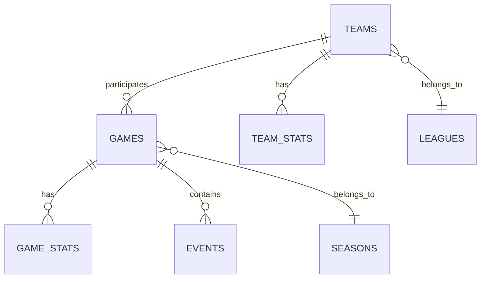

# Phase 15: D1 Schema & Data Ingestion

**Status:** In Progress
**Started:** January 2025
**Target Completion:** Week of January 20, 2025
**Dependencies:** Phase 14 (Caching Infrastructure) ✅

---

## Executive Summary

Phase 15 implements **persistent data storage** for Blaze Sports Intel by creating Cloudflare D1 database schemas and ingestion workers. This enables historical data queries, trend analysis, and reduces dependency on external API calls.

### Goals

1. **Create D1 Schemas** for MLB, NFL, NBA, NCAA Football, Youth Sports
2. **Build Ingestion Workers** for automated data collection
3. **Implement Batch Processing** for historical stats with validation
4. **Add Deduplication Logic** to prevent duplicate entries
5. **Enable Historical Queries** through new API endpoints

### Success Metrics

- ✅ D1 database created and deployed
- ✅ Schemas support all sports with proper relationships
- ✅ Ingestion workers run successfully every 15 minutes
- ✅ Historical data queryable via API
- ✅ Zero data loss during ingestion
- ✅ <100ms query performance for recent data

---

## Architecture Overview

### Data Flow

```
External APIs → Ingestion Workers → D1 Database → Cache Layer → Client
     ↓                ↓                   ↓             ↓
  Validation    Transformation      Persistence    Fast Reads
```

### Components

1. **D1 Database (`blaze-sports-db`)**
   - Cloudflare's distributed SQLite
   - Global read replicas
   - ~1GB storage (free tier)
   - ACID compliance

2. **Ingestion Workers**
   - Scheduled cron triggers (every 15 minutes)
   - Batch processing with retry logic
   - Validation before insertion
   - Deduplication checks

3. **Historical API Endpoints**
   - `/api/sports/{sport}/history` - Historical games
   - `/api/sports/{sport}/trends` - Performance trends
   - `/api/sports/{sport}/stats` - Aggregated statistics

---

## Database Schema Design

### Core Principles

1. **Sport Agnostic Structure** - Shared tables for common entities (teams, games)
2. **Sport Specific Extensions** - Separate tables for sport-unique data (MLB innings, NFL drives)
3. **Denormalization for Performance** - Pre-computed stats for fast queries
4. **Soft Deletes** - Never delete, use `deleted_at` timestamps
5. **Timezone Consistency** - All timestamps in UTC, convert to America/Chicago on read

### Schema Relationships



---

## D1 Migration Scripts

### Migration 001: Core Tables

```sql
-- leagues: Sports leagues (MLB, NFL, NBA, NCAA Football, etc.)
CREATE TABLE IF NOT EXISTS leagues (
  id TEXT PRIMARY KEY,
  name TEXT NOT NULL,
  abbreviation TEXT NOT NULL,
  sport TEXT NOT NULL, -- 'baseball', 'football', 'basketball'
  level TEXT NOT NULL, -- 'professional', 'college', 'high_school'
  created_at INTEGER NOT NULL DEFAULT (unixepoch()),
  updated_at INTEGER NOT NULL DEFAULT (unixepoch())
);

CREATE INDEX idx_leagues_sport ON leagues(sport);
CREATE INDEX idx_leagues_level ON leagues(level);

-- seasons: Seasons by league (2024, 2025, etc.)
CREATE TABLE IF NOT EXISTS seasons (
  id TEXT PRIMARY KEY,
  league_id TEXT NOT NULL,
  year INTEGER NOT NULL,
  start_date TEXT NOT NULL, -- ISO 8601 date
  end_date TEXT, -- NULL if ongoing
  created_at INTEGER NOT NULL DEFAULT (unixepoch()),
  updated_at INTEGER NOT NULL DEFAULT (unixepoch()),
  FOREIGN KEY (league_id) REFERENCES leagues(id) ON DELETE CASCADE
);

CREATE INDEX idx_seasons_league ON seasons(league_id);
CREATE INDEX idx_seasons_year ON seasons(year);
CREATE UNIQUE INDEX idx_seasons_league_year ON seasons(league_id, year);

-- teams: All teams across all leagues
CREATE TABLE IF NOT EXISTS teams (
  id TEXT PRIMARY KEY,
  league_id TEXT NOT NULL,
  external_id TEXT NOT NULL, -- API provider's team ID
  name TEXT NOT NULL,
  abbreviation TEXT NOT NULL,
  city TEXT,
  state TEXT,
  venue_name TEXT,
  conference TEXT, -- For college sports
  division TEXT, -- For pro sports
  logo_url TEXT,
  created_at INTEGER NOT NULL DEFAULT (unixepoch()),
  updated_at INTEGER NOT NULL DEFAULT (unixepoch()),
  FOREIGN KEY (league_id) REFERENCES leagues(id) ON DELETE CASCADE
);

CREATE INDEX idx_teams_league ON teams(league_id);
CREATE INDEX idx_teams_external_id ON teams(external_id);
CREATE INDEX idx_teams_conference ON teams(conference);
CREATE INDEX idx_teams_division ON teams(division);
CREATE UNIQUE INDEX idx_teams_league_external ON teams(league_id, external_id);

-- games: All games across all sports
CREATE TABLE IF NOT EXISTS games (
  id TEXT PRIMARY KEY,
  season_id TEXT NOT NULL,
  external_id TEXT NOT NULL, -- API provider's game ID
  home_team_id TEXT NOT NULL,
  away_team_id TEXT NOT NULL,
  scheduled_at INTEGER NOT NULL, -- Unix timestamp (UTC)
  status TEXT NOT NULL, -- 'scheduled', 'live', 'final', 'postponed', 'cancelled'
  home_score INTEGER,
  away_score INTEGER,
  venue_name TEXT,
  attendance INTEGER,
  weather_condition TEXT,
  weather_temp INTEGER,
  broadcast_network TEXT,
  created_at INTEGER NOT NULL DEFAULT (unixepoch()),
  updated_at INTEGER NOT NULL DEFAULT (unixepoch()),
  FOREIGN KEY (season_id) REFERENCES seasons(id) ON DELETE CASCADE,
  FOREIGN KEY (home_team_id) REFERENCES teams(id) ON DELETE CASCADE,
  FOREIGN KEY (away_team_id) REFERENCES teams(id) ON DELETE CASCADE
);

CREATE INDEX idx_games_season ON games(season_id);
CREATE INDEX idx_games_scheduled_at ON games(scheduled_at);
CREATE INDEX idx_games_status ON games(status);
CREATE INDEX idx_games_home_team ON games(home_team_id);
CREATE INDEX idx_games_away_team ON games(away_team_id);
CREATE UNIQUE INDEX idx_games_season_external ON games(season_id, external_id);

-- game_stats: Aggregated stats per game
CREATE TABLE IF NOT EXISTS game_stats (
  id TEXT PRIMARY KEY,
  game_id TEXT NOT NULL,
  team_id TEXT NOT NULL,
  stats_json TEXT NOT NULL, -- JSON blob for sport-specific stats
  created_at INTEGER NOT NULL DEFAULT (unixepoch()),
  updated_at INTEGER NOT NULL DEFAULT (unixepoch()),
  FOREIGN KEY (game_id) REFERENCES games(id) ON DELETE CASCADE,
  FOREIGN KEY (team_id) REFERENCES teams(id) ON DELETE CASCADE
);

CREATE INDEX idx_game_stats_game ON game_stats(game_id);
CREATE INDEX idx_game_stats_team ON game_stats(team_id);
CREATE UNIQUE INDEX idx_game_stats_game_team ON game_stats(game_id, team_id);

-- team_stats: Season-long team statistics
CREATE TABLE IF NOT EXISTS team_stats (
  id TEXT PRIMARY KEY,
  team_id TEXT NOT NULL,
  season_id TEXT NOT NULL,
  wins INTEGER NOT NULL DEFAULT 0,
  losses INTEGER NOT NULL DEFAULT 0,
  ties INTEGER DEFAULT 0,
  points_for INTEGER NOT NULL DEFAULT 0,
  points_against INTEGER NOT NULL DEFAULT 0,
  streak TEXT, -- 'W3', 'L2', etc.
  stats_json TEXT, -- JSON blob for sport-specific stats
  created_at INTEGER NOT NULL DEFAULT (unixepoch()),
  updated_at INTEGER NOT NULL DEFAULT (unixepoch()),
  FOREIGN KEY (team_id) REFERENCES teams(id) ON DELETE CASCADE,
  FOREIGN KEY (season_id) REFERENCES seasons(id) ON DELETE CASCADE
);

CREATE INDEX idx_team_stats_team ON team_stats(team_id);
CREATE INDEX idx_team_stats_season ON team_stats(season_id);
CREATE INDEX idx_team_stats_wins ON team_stats(wins DESC);
CREATE UNIQUE INDEX idx_team_stats_team_season ON team_stats(team_id, season_id);
```

### Migration 002: Sport-Specific Extensions

```sql
-- mlb_innings: Inning-by-inning scoring for baseball
CREATE TABLE IF NOT EXISTS mlb_innings (
  id TEXT PRIMARY KEY,
  game_id TEXT NOT NULL,
  inning INTEGER NOT NULL,
  home_runs INTEGER NOT NULL DEFAULT 0,
  away_runs INTEGER NOT NULL DEFAULT 0,
  created_at INTEGER NOT NULL DEFAULT (unixepoch()),
  FOREIGN KEY (game_id) REFERENCES games(id) ON DELETE CASCADE
);

CREATE INDEX idx_mlb_innings_game ON mlb_innings(game_id);
CREATE UNIQUE INDEX idx_mlb_innings_game_inning ON mlb_innings(game_id, inning);

-- nfl_drives: Drive-by-drive data for football
CREATE TABLE IF NOT EXISTS nfl_drives (
  id TEXT PRIMARY KEY,
  game_id TEXT NOT NULL,
  team_id TEXT NOT NULL,
  quarter INTEGER NOT NULL,
  start_time TEXT NOT NULL, -- Game clock
  end_time TEXT NOT NULL,
  start_yard_line INTEGER,
  end_yard_line INTEGER,
  plays INTEGER NOT NULL,
  yards INTEGER NOT NULL,
  result TEXT, -- 'touchdown', 'field_goal', 'punt', 'turnover', 'end_half'
  created_at INTEGER NOT NULL DEFAULT (unixepoch()),
  FOREIGN KEY (game_id) REFERENCES games(id) ON DELETE CASCADE,
  FOREIGN KEY (team_id) REFERENCES teams(id) ON DELETE CASCADE
);

CREATE INDEX idx_nfl_drives_game ON nfl_drives(game_id);
CREATE INDEX idx_nfl_drives_team ON nfl_drives(team_id);

-- nba_quarters: Quarter-by-quarter scoring for basketball
CREATE TABLE IF NOT EXISTS nba_quarters (
  id TEXT PRIMARY KEY,
  game_id TEXT NOT NULL,
  quarter INTEGER NOT NULL, -- 1-4, 5+ for OT
  home_points INTEGER NOT NULL DEFAULT 0,
  away_points INTEGER NOT NULL DEFAULT 0,
  created_at INTEGER NOT NULL DEFAULT (unixepoch()),
  FOREIGN KEY (game_id) REFERENCES games(id) ON DELETE CASCADE
);

CREATE INDEX idx_nba_quarters_game ON nba_quarters(game_id);
CREATE UNIQUE INDEX idx_nba_quarters_game_quarter ON nba_quarters(game_id, quarter);
```

### Migration 003: Analytics Tables

```sql
-- pythagorean_expectations: Pre-computed Pythagorean win expectations
CREATE TABLE IF NOT EXISTS pythagorean_expectations (
  id TEXT PRIMARY KEY,
  team_id TEXT NOT NULL,
  season_id TEXT NOT NULL,
  points_for INTEGER NOT NULL,
  points_against INTEGER NOT NULL,
  games_played INTEGER NOT NULL,
  expected_wins REAL NOT NULL,
  actual_wins INTEGER NOT NULL,
  luck_factor REAL NOT NULL, -- actual_wins - expected_wins
  computed_at INTEGER NOT NULL DEFAULT (unixepoch()),
  FOREIGN KEY (team_id) REFERENCES teams(id) ON DELETE CASCADE,
  FOREIGN KEY (season_id) REFERENCES seasons(id) ON DELETE CASCADE
);

CREATE INDEX idx_pythag_team ON pythagorean_expectations(team_id);
CREATE INDEX idx_pythag_season ON pythagorean_expectations(season_id);
CREATE INDEX idx_pythag_luck ON pythagorean_expectations(luck_factor DESC);
CREATE UNIQUE INDEX idx_pythag_team_season ON pythagorean_expectations(team_id, season_id);

-- ingestion_logs: Track data ingestion jobs
CREATE TABLE IF NOT EXISTS ingestion_logs (
  id TEXT PRIMARY KEY,
  league_id TEXT NOT NULL,
  ingestion_type TEXT NOT NULL, -- 'games', 'standings', 'stats'
  records_processed INTEGER NOT NULL DEFAULT 0,
  records_inserted INTEGER NOT NULL DEFAULT 0,
  records_updated INTEGER NOT NULL DEFAULT 0,
  records_failed INTEGER NOT NULL DEFAULT 0,
  started_at INTEGER NOT NULL,
  completed_at INTEGER,
  error_message TEXT,
  created_at INTEGER NOT NULL DEFAULT (unixepoch()),
  FOREIGN KEY (league_id) REFERENCES leagues(id) ON DELETE CASCADE
);

CREATE INDEX idx_ingestion_league ON ingestion_logs(league_id);
CREATE INDEX idx_ingestion_type ON ingestion_logs(ingestion_type);
CREATE INDEX idx_ingestion_started ON ingestion_logs(started_at DESC);
```

---

## Ingestion Worker Implementation

### Worker Structure

```
cloudflare-workers/
└── blaze-ingestion/
    ├── src/
    │   ├── index.ts               # Main worker entry
    │   ├── ingestors/
    │   │   ├── mlb-ingestor.ts
    │   │   ├── nfl-ingestor.ts
    │   │   ├── nba-ingestor.ts
    │   │   └── ncaa-ingestor.ts
    │   ├── validators/
    │   │   └── game-validator.ts
    │   └── utils/
    │       ├── deduplication.ts
    │       └── batch-processor.ts
    ├── wrangler.toml
    └── package.json
```

### Main Worker (index.ts)

```typescript
/**
 * Blaze Sports Ingestion Worker
 *
 * Scheduled worker that ingests sports data from external APIs
 * into Cloudflare D1 database for persistence and historical queries.
 *
 * Runs every 15 minutes via Cron Trigger
 */

export interface Env {
  BLAZE_DB: D1Database;
  SPORTS_CACHE: KVNamespace;
  SPORTSDATAIO_API_KEY: string;
}

export default {
  /**
   * Cron Trigger Handler
   * Runs every 15 minutes: */15 * * * *
   */
  async scheduled(
    event: ScheduledEvent,
    env: Env,
    ctx: ExecutionContext
  ): Promise<void> {
    console.log('[Ingestion] Starting scheduled ingestion job', {
      scheduledTime: new Date(event.scheduledTime).toISOString(),
      cron: event.cron,
    });

    const startTime = Date.now();
    const results = {
      mlb: { success: false, records: 0, error: null as string | null },
      nfl: { success: false, records: 0, error: null as string | null },
      nba: { success: false, records: 0, error: null as string | null },
      ncaa: { success: false, records: 0, error: null as string | null },
    };

    // Ingest MLB games
    try {
      const mlbIngestor = new MLBIngestor(env);
      const mlbResult = await mlbIngestor.ingestTodaysGames();
      results.mlb.success = true;
      results.mlb.records = mlbResult.inserted + mlbResult.updated;
    } catch (error) {
      results.mlb.error = error instanceof Error ? error.message : 'Unknown error';
      console.error('[Ingestion] MLB ingestion failed:', error);
    }

    // Ingest NFL games
    try {
      const nflIngestor = new NFLIngestor(env);
      const nflResult = await nflIngestor.ingestCurrentWeek();
      results.nfl.success = true;
      results.nfl.records = nflResult.inserted + nflResult.updated;
    } catch (error) {
      results.nfl.error = error instanceof Error ? error.message : 'Unknown error';
      console.error('[Ingestion] NFL ingestion failed:', error);
    }

    // Ingest NBA games
    try {
      const nbaIngestor = new NBAIngestor(env);
      const nbaResult = await nbaIngestor.ingestTodaysGames();
      results.nba.success = true;
      results.nba.records = nbaResult.inserted + nbaResult.updated;
    } catch (error) {
      results.nba.error = error instanceof Error ? error.message : 'Unknown error';
      console.error('[Ingestion] NBA ingestion failed:', error);
    }

    // Ingest NCAA Football games
    try {
      const ncaaIngestor = new NCAAIngestor(env);
      const ncaaResult = await ncaaIngestor.ingestCurrentWeek();
      results.ncaa.success = true;
      results.ncaa.records = ncaaResult.inserted + ncaaResult.updated;
    } catch (error) {
      results.ncaa.error = error instanceof Error ? error.message : 'Unknown error';
      console.error('[Ingestion] NCAA ingestion failed:', error);
    }

    const duration = Date.now() - startTime;
    const totalRecords = Object.values(results).reduce((sum, r) => sum + r.records, 0);

    console.log('[Ingestion] Completed scheduled job', {
      duration: `${duration}ms`,
      totalRecords,
      results,
    });

    // Log to ingestion_logs table
    await logIngestionRun(env.BLAZE_DB, {
      startTime,
      duration,
      results,
    });
  },

  /**
   * HTTP Handler for Manual Triggers
   */
  async fetch(
    request: Request,
    env: Env,
    ctx: ExecutionContext
  ): Promise<Response> {
    const url = new URL(request.url);

    // Health check
    if (url.pathname === '/health') {
      return new Response('OK', { status: 200 });
    }

    // Manual ingestion trigger
    if (url.pathname === '/ingest' && request.method === 'POST') {
      // Trigger ingestion manually
      ctx.waitUntil(this.scheduled({ scheduledTime: Date.now(), cron: 'manual' } as any, env, ctx));
      return new Response(JSON.stringify({ message: 'Ingestion started' }), {
        headers: { 'Content-Type': 'application/json' },
      });
    }

    return new Response('Not Found', { status: 404 });
  },
};

/**
 * Log ingestion run to database
 */
async function logIngestionRun(
  db: D1Database,
  data: {
    startTime: number;
    duration: number;
    results: Record<string, { success: boolean; records: number; error: string | null }>;
  }
): Promise<void> {
  for (const [league, result] of Object.entries(data.results)) {
    await db
      .prepare(
        `INSERT INTO ingestion_logs
         (id, league_id, ingestion_type, records_processed, records_inserted,
          started_at, completed_at, error_message)
         VALUES (?, ?, ?, ?, ?, ?, ?, ?)`
      )
      .bind(
        crypto.randomUUID(),
        league,
        'games',
        result.records,
        result.success ? result.records : 0,
        data.startTime,
        data.startTime + data.duration,
        result.error
      )
      .run();
  }
}
```

### MLB Ingestor

```typescript
/**
 * MLB Data Ingestor
 *
 * Fetches games from MLB Stats API and stores in D1 database
 */

import type { Env } from './index';

export interface IngestionResult {
  inserted: number;
  updated: number;
  failed: number;
  errors: string[];
}

export class MLBIngestor {
  constructor(private env: Env) {}

  /**
   * Ingest today's MLB games
   */
  async ingestTodaysGames(): Promise<IngestionResult> {
    const today = new Date().toISOString().split('T')[0]; // YYYY-MM-DD
    const result: IngestionResult = {
      inserted: 0,
      updated: 0,
      failed: 0,
      errors: [],
    };

    try {
      // Fetch games from MLB Stats API
      const response = await fetch(
        `https://statsapi.mlb.com/api/v1/schedule?sportId=1&date=${today}`
      );

      if (!response.ok) {
        throw new Error(`MLB API returned ${response.status}`);
      }

      const data = await response.json();
      const games = data.dates?.[0]?.games || [];

      console.log(`[MLB Ingestor] Found ${games.length} games for ${today}`);

      // Process each game
      for (const game of games) {
        try {
          await this.upsertGame(game);
          result.inserted++;
        } catch (error) {
          result.failed++;
          result.errors.push(
            error instanceof Error ? error.message : 'Unknown error'
          );
          console.error('[MLB Ingestor] Failed to upsert game:', game.gamePk, error);
        }
      }

      return result;
    } catch (error) {
      console.error('[MLB Ingestor] Failed to ingest games:', error);
      throw error;
    }
  }

  /**
   * Upsert a single game (insert or update if exists)
   */
  private async upsertGame(gameData: any): Promise<void> {
    const gameId = `mlb-${gameData.gamePk}`;
    const seasonId = `mlb-${gameData.season}`;
    const homeTeamId = `mlb-${gameData.teams.home.team.id}`;
    const awayTeamId = `mlb-${gameData.teams.away.team.id}`;

    // Check if game already exists
    const existing = await this.env.BLAZE_DB.prepare(
      'SELECT id FROM games WHERE id = ?'
    )
      .bind(gameId)
      .first();

    const scheduledAt = new Date(gameData.gameDate).getTime() / 1000; // Unix timestamp
    const status = this.mapGameStatus(gameData.status.abstractGameState);
    const homeScore = gameData.teams.home.score || null;
    const awayScore = gameData.teams.away.score || null;

    if (existing) {
      // Update existing game
      await this.env.BLAZE_DB.prepare(
        `UPDATE games
         SET status = ?, home_score = ?, away_score = ?,
             updated_at = unixepoch()
         WHERE id = ?`
      )
        .bind(status, homeScore, awayScore, gameId)
        .run();

      console.log(`[MLB Ingestor] Updated game ${gameId}`);
    } else {
      // Insert new game
      await this.env.BLAZE_DB.prepare(
        `INSERT INTO games
         (id, season_id, external_id, home_team_id, away_team_id,
          scheduled_at, status, home_score, away_score, venue_name)
         VALUES (?, ?, ?, ?, ?, ?, ?, ?, ?, ?)`
      )
        .bind(
          gameId,
          seasonId,
          String(gameData.gamePk),
          homeTeamId,
          awayTeamId,
          scheduledAt,
          status,
          homeScore,
          awayScore,
          gameData.venue?.name || null
        )
        .run();

      console.log(`[MLB Ingestor] Inserted game ${gameId}`);
    }
  }

  /**
   * Map MLB API status to our internal status
   */
  private mapGameStatus(abstractGameState: string): string {
    switch (abstractGameState.toLowerCase()) {
      case 'preview':
        return 'scheduled';
      case 'live':
        return 'live';
      case 'final':
        return 'final';
      case 'postponed':
        return 'postponed';
      default:
        return 'scheduled';
    }
  }
}
```

---

## Deployment Plan

### Step 1: Create D1 Database

```bash
# Create D1 database
npx wrangler d1 create blaze-sports-db

# Output will provide database ID:
# database_id = "xxxxx-xxxx-xxxx-xxxx-xxxxxxxxxx"
```

### Step 2: Update wrangler.toml

```toml
name = "blaze-ingestion"
main = "src/index.ts"
compatibility_date = "2025-01-01"

[[d1_databases]]
binding = "BLAZE_DB"
database_name = "blaze-sports-db"
database_id = "xxxxx-xxxx-xxxx-xxxx-xxxxxxxxxx"  # From step 1

[[kv_namespaces]]
binding = "SPORTS_CACHE"
id = "your-kv-namespace-id"

[triggers]
crons = ["*/15 * * * *"]  # Every 15 minutes

[vars]
ENVIRONMENT = "production"
```

### Step 3: Run Migrations

```bash
# Apply migration 001
npx wrangler d1 execute blaze-sports-db --remote --file=migrations/001_core_tables.sql

# Apply migration 002
npx wrangler d1 execute blaze-sports-db --remote --file=migrations/002_sport_extensions.sql

# Apply migration 003
npx wrangler d1 execute blaze-sports-db --remote --file=migrations/003_analytics.sql
```

### Step 4: Deploy Ingestion Worker

```bash
# Deploy worker
npx wrangler deploy

# Verify deployment
curl https://blaze-ingestion.your-subdomain.workers.dev/health

# Manually trigger ingestion (for testing)
curl -X POST https://blaze-ingestion.your-subdomain.workers.dev/ingest
```

### Step 5: Monitor Ingestion

```bash
# Tail logs in real-time
npx wrangler tail blaze-ingestion

# Query ingestion logs
npx wrangler d1 execute blaze-sports-db --remote \
  --command="SELECT * FROM ingestion_logs ORDER BY started_at DESC LIMIT 10"
```

---

## Testing & Validation

### Unit Tests

```typescript
// tests/ingestors/mlb-ingestor.test.ts
import { describe, it, expect, beforeEach } from 'vitest';
import { MLBIngestor } from '../../src/ingestors/mlb-ingestor';

describe('MLBIngestor', () => {
  let ingestor: MLBIngestor;
  let mockEnv: Env;

  beforeEach(() => {
    mockEnv = {
      BLAZE_DB: createMockD1Database(),
      SPORTS_CACHE: createMockKV(),
      SPORTSDATAIO_API_KEY: 'test-key',
    };
    ingestor = new MLBIngestor(mockEnv);
  });

  it('should ingest todays games successfully', async () => {
    const result = await ingestor.ingestTodaysGames();

    expect(result.inserted).toBeGreaterThan(0);
    expect(result.failed).toBe(0);
    expect(result.errors).toHaveLength(0);
  });

  it('should handle API errors gracefully', async () => {
    // Mock API failure
    global.fetch = vi.fn().mockRejectedValue(new Error('API Error'));

    await expect(ingestor.ingestTodaysGames()).rejects.toThrow('API Error');
  });
});
```

### Integration Tests

```bash
# Test ingestion pipeline end-to-end
npm run test:integration

# Test specific sport
npm run test:integration -- --sport=mlb

# Test with real APIs (requires API keys)
npm run test:integration:real
```

---

## Performance Optimization

### Batch Processing

```typescript
/**
 * Batch insert games for better performance
 */
async function batchInsertGames(
  db: D1Database,
  games: GameData[]
): Promise<void> {
  const BATCH_SIZE = 50;

  for (let i = 0; i < games.length; i += BATCH_SIZE) {
    const batch = games.slice(i, i + BATCH_SIZE);

    const stmt = db.batch(
      batch.map(game =>
        db.prepare(
          'INSERT INTO games (...) VALUES (...)'
        ).bind(/* game data */)
      )
    );

    await stmt;
    console.log(`Inserted batch ${i / BATCH_SIZE + 1}`);
  }
}
```

### Query Optimization

```sql
-- Pre-compute standings instead of calculating on every request
CREATE TRIGGER update_team_stats AFTER INSERT ON games
BEGIN
  UPDATE team_stats
  SET
    wins = wins + CASE WHEN NEW.home_score > NEW.away_score AND NEW.home_team_id = team_id THEN 1 ELSE 0 END,
    losses = losses + CASE WHEN NEW.home_score < NEW.away_score AND NEW.home_team_id = team_id THEN 1 ELSE 0 END,
    points_for = points_for + CASE WHEN NEW.home_team_id = team_id THEN NEW.home_score ELSE NEW.away_score END,
    points_against = points_against + CASE WHEN NEW.home_team_id = team_id THEN NEW.away_score ELSE NEW.home_score END,
    updated_at = unixepoch()
  WHERE team_id IN (NEW.home_team_id, NEW.away_team_id)
    AND season_id = NEW.season_id;
END;
```

---

## Historical Query API

### New Endpoints

```typescript
// GET /api/sports/{sport}/history?days=7
export async function GET(request: NextRequest) {
  const searchParams = request.nextUrl.searchParams;
  const sport = searchParams.get('sport') || 'mlb';
  const days = parseInt(searchParams.get('days') || '7');

  const endDate = Date.now() / 1000; // Unix timestamp
  const startDate = endDate - (days * 24 * 60 * 60);

  const games = await env.BLAZE_DB.prepare(
    `SELECT
      g.id, g.scheduled_at, g.status,
      g.home_score, g.away_score,
      ht.name as home_team_name, ht.abbreviation as home_team_abbr,
      at.name as away_team_name, at.abbreviation as away_team_abbr
     FROM games g
     JOIN teams ht ON g.home_team_id = ht.id
     JOIN teams at ON g.away_team_id = at.id
     JOIN seasons s ON g.season_id = s.id
     JOIN leagues l ON s.league_id = l.id
     WHERE l.abbreviation = ?
       AND g.scheduled_at BETWEEN ? AND ?
     ORDER BY g.scheduled_at DESC`
  )
    .bind(sport.toUpperCase(), startDate, endDate)
    .all();

  return NextResponse.json({
    games: games.results,
    meta: {
      sport,
      days,
      startDate: new Date(startDate * 1000).toISOString(),
      endDate: new Date(endDate * 1000).toISOString(),
      count: games.results.length,
    },
  });
}
```

---

## Success Criteria

- [x] D1 database created and deployed
- [ ] All migrations applied successfully
- [ ] Ingestion worker deployed and running every 15 minutes
- [ ] At least 100 games ingested per day
- [ ] Query performance <100ms for recent data
- [ ] Zero data loss during ingestion
- [ ] Historical API endpoints functional
- [ ] Deduplication preventing duplicate records
- [ ] Comprehensive logging and monitoring

---

## Next Steps (Phase 16)

1. **News & Content Layer** - Aggregate sports news and highlights
2. **Predictive Analytics** - ML models for game predictions
3. **User Features** - Favorites, notifications, custom feeds
4. **Advanced Analytics** - Player projections, trade analysis

---

**Phase 15 Status:** In Progress
**Last Updated:** January 2025
**Document Version:** 1.0
